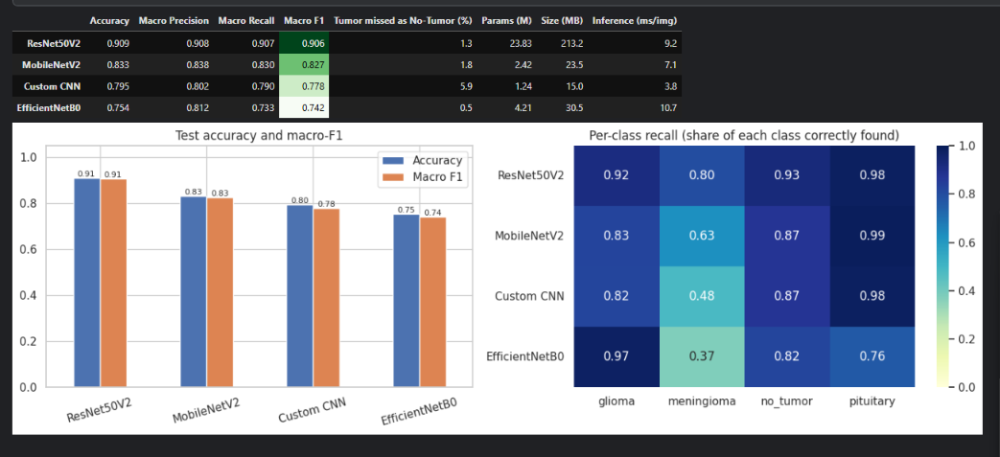
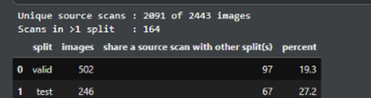
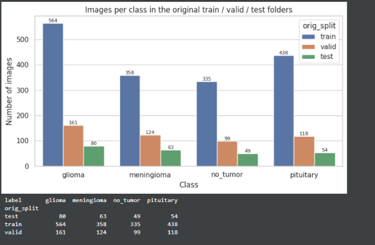
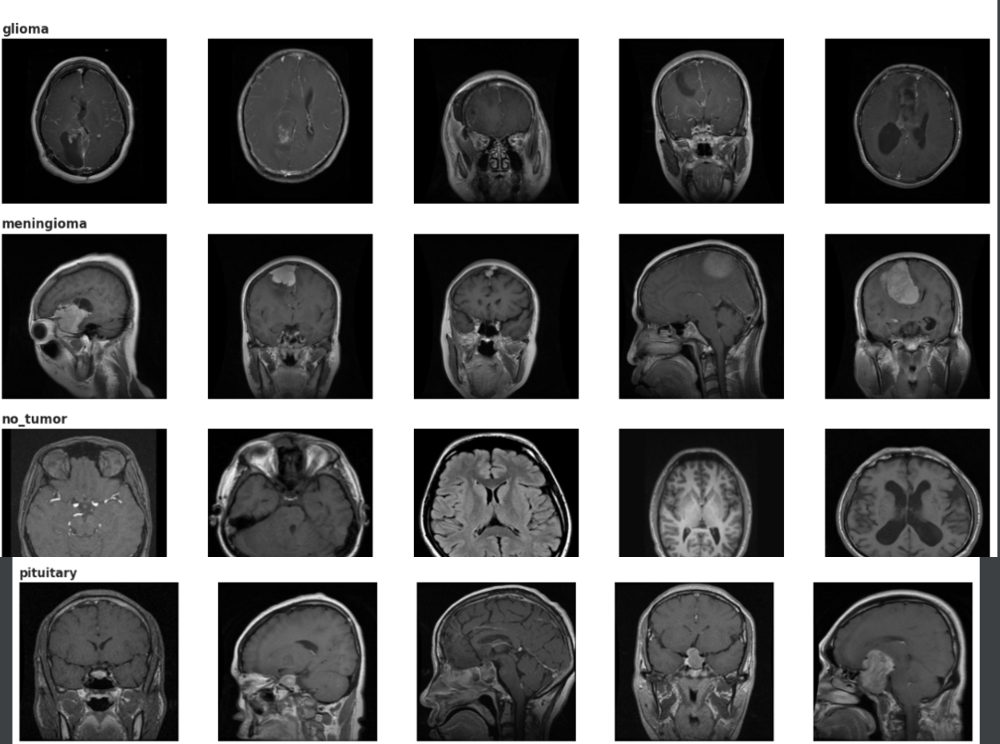
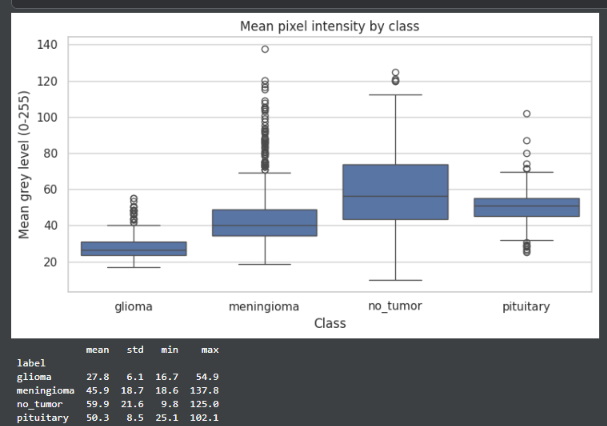
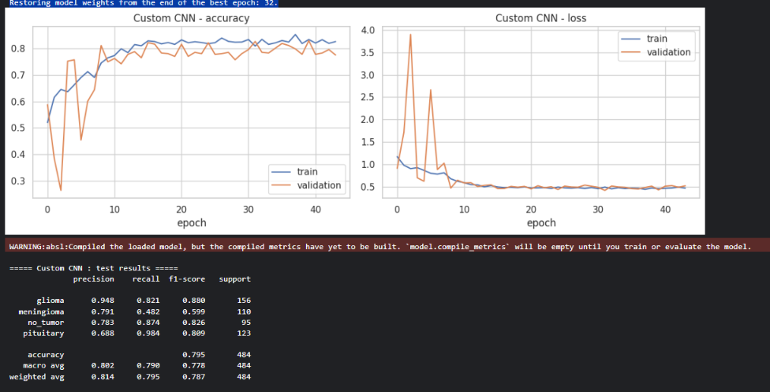
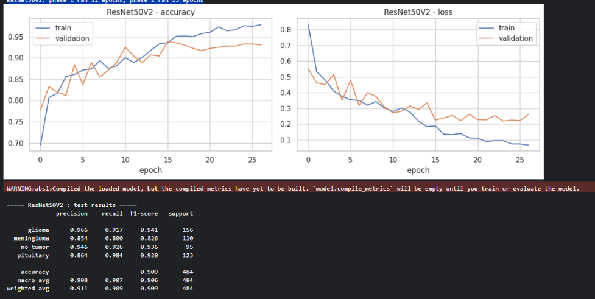
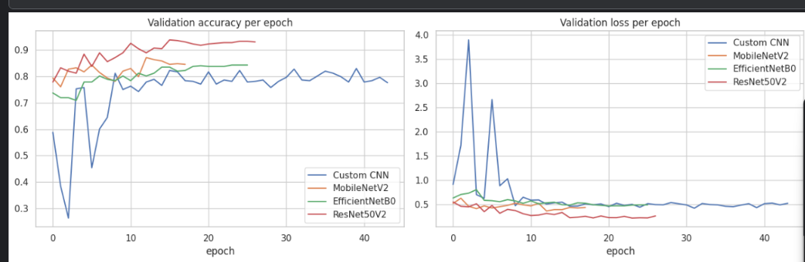
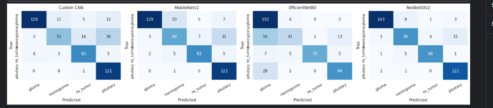

# Brain Tumor MRI Image Classification

Deep-learning classifier for brain MRI images (**glioma, meningioma, pituitary tumor, no tumor**): a custom CNN built from scratch, three ImageNet transfer-learning models (MobileNetV2, EfficientNetB0, ResNet50V2), and a Streamlit app for real-time predictions.

> Educational project. **Not a medical device** - never use it for diagnosis or treatment decisions.

## Results (test split of 484 images, no source-scan overlap with training)

| Model | Accuracy | Macro-F1 | Tumor missed as no-tumor | File size (MB) |
|---|---|---|---|---|
| **ResNet50V2** | **0.909** | **0.906** | 1.3% (5 of 389) | 95.7 deployed (213.2*) |
| MobileNetV2 | 0.833 | 0.827 | 1.8% | 23.5* |
| Custom CNN | 0.795 | 0.778 | 5.9% | 15.0* |
| EfficientNetB0 | 0.754 | 0.742 | 0.5% | 30.5* |

\* Training checkpoint size (includes optimizer state). The deployed `models/best_model.h5` was saved without it.

**Deployed model: ResNet50V2** (`models/best_model.h5`). Reason: the highest accuracy and macro-F1 (about 7 macro-F1 points ahead of the next model), only 5 of 389 tumor images missed as "no tumor", and about 9 ms per image on a T4 GPU. EfficientNetB0 has a lower miss rate (0.5%) but only 75% accuracy, so it is not usable.

Scores are from one test split and one training run; weaker models moved by 1-4 points between two full runs, so only the ResNet50V2 lead is clearly real. With 484 test images, ResNet50V2's accuracy has roughly +/- 2.5 points of uncertainty.



## Key finding: the provided train/valid/test split leaks data

The dataset is a Roboflow export in which augmented copies of the **same scan** appear in different splits (detected through the source ID in each file name). In the provided folders, **27.2% of the test images and 19.3% of the validation images share a source scan with other splits**, which would inflate any test score.



Fix: all images were merged and re-split **grouped by source scan** (StratifiedGroupKFold, 1571 train / 388 validation / 484 test), with an assertion in the notebook that no scan appears in two splits.

## Data

Roboflow "Labeled MRI Brain Tumor Dataset v1" (CC BY 4.0): 2,443 JPG images (640x640 RGB), 4 classes, mild class imbalance (glioma is the largest class).



The images vary in scan plane, zoom and contrast, and the class seems to be correlated with scan plane (for example all five no_tumor samples shown are axial, none of the pituitary samples are).



Glioma images are also clearly darker than the other classes, so brightness is a possible shortcut (see limitations).



## Method

- Resize to 224x224; pixel scaling is part of each model (0-1 for the custom CNN, the backbone's own scaling for pretrained models).
- Augmentation during training only: horizontal flip, rotation, zoom, shift, contrast, brightness. Vertical flip is left out on purpose (upside-down scans do not occur).
- Class weights for the mild imbalance; EarlyStopping, ModelCheckpoint and ReduceLROnPlateau on every model.
- Custom CNN: 4 conv blocks (2 conv + BatchNorm + ReLU each), global average pooling, dropout, dense head.
- Transfer learning: frozen backbone first (new head only), then fine-tuning of the top 30 backbone layers at a low learning rate (BatchNorm layers stay frozen).





My first custom CNN stayed at about 33% validation accuracy while training accuracy kept rising. After removing the Dropout layers placed between conv blocks (right before BatchNorm) and lowering BatchNorm momentum to 0.9, it reached 79.5% test accuracy. I changed both at once, so I cannot say which change mattered.

## Where the models struggle

Meningioma is the hardest class for every model (recall 0.80 for ResNet50V2, 0.63 MobileNetV2, 0.48 Custom CNN, 0.37 EfficientNetB0) and is most often predicted as pituitary (15 of 110 images for ResNet50V2).



## Project structure

```
Brain-Tumor-MRI-Classification.ipynb   # EDA, leakage check, training, evaluation, comparison
app.py                                 # Streamlit app
requirements.txt
models/
  best_model.h5                        # deployed ResNet50V2 (91 MB)
  class_names.json
results/                               # charts shown in this README
```

## How to run the app

```
pip install -r requirements.txt
streamlit run app.py
```

Upload an MRI image (JPG/PNG); the app shows the predicted class, the confidence, and the probability of every class. The training notebook was run on Kaggle (GPU); set `DATA_ROOT` at the top and use `QUICK_TEST = True` first for a short dry run.

## Limitations

- Small dataset (about 2.4k images) from a single public source; no external hospital validation.
- Scan plane and brightness correlate with the class, so the model may partly rely on them instead of the tumor itself; real-world accuracy is likely lower than reported.
- Confidence scores are not calibrated: the app can show very high confidence on images unlike the training data (for example other sequences or low-resolution images), even when it is wrong.
- Single test split and a single run; small differences between the weaker models are within run-to-run noise.
